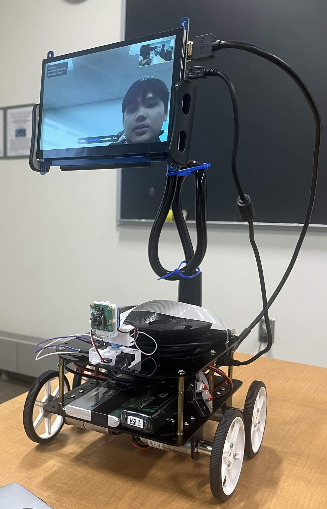
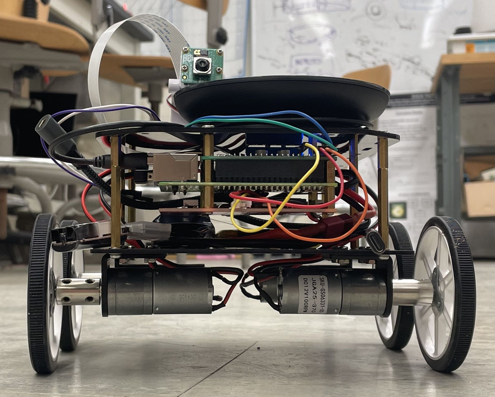
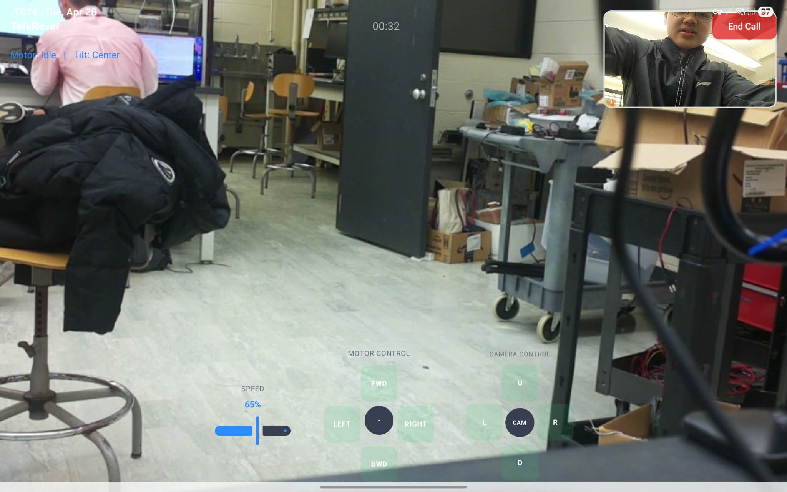
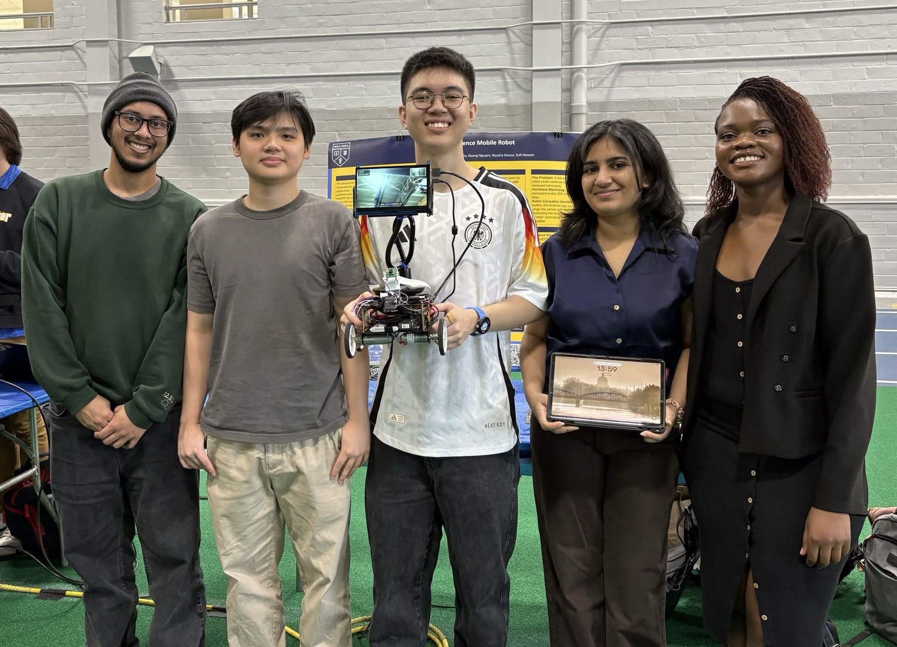

# Telerover: App-Controlled Telepresence Rover

    

## About Telerover

  

Telerover is a proof-of-concept (PoC) telepresence rover designed to demonstrate the integration of low-level hardware control, real-time two-way audio/video streaming, and full-stack software architecture. Inspiration was largely taken from [enabot's ROLA Mini FamilyBot](https://store.enabot.com/products/rola-mini-familybot), although the crude Telerover features way more zipties, tape and standoffs than a polished consumer product.

The rover consists of a 4-wheel differential drive, 2-tier chassis powered by a Raspberry Pi 4B, which handles local hardware control, peripheral interfacing and WebRTC media routing. A Node.js signaling server brokers peer-to-peer connections between the rover and remote clients (web interface/mobile app), allowing for ultra-low-latency video feeds and instantaneous motor/camera control. 

To complement the rover, an Android mobile app was also developed using React Native to act as a client that connects to the Pi-hosted Node.js server and provides an interactive UI for telepresence and rover control.

### Demonstrated Functions:

  

* **Real-time communication:** Low-latency peer-to-peer A/V streaming using WebRTC.
* **Hardware control:** PWM motor control and I2C servo manipulation via Python.
* **Inter-process communication:** Node.js spawning, managing, and exchanging data with low-level Python scripts.
* **User interface:** Web and React Native mobile app clients for remote operation.

## System Architecture

  

### Hardware Stack
The physical rover is built on a 4WD two-tier compact chassis:

  

* **Compute:** Raspberry Pi 4B.
* **Motor control:** Pololu Dual MC33926 Motor Driver Shield.
* **Drivetrain:** 4-wheel differential drive.
    * 4x 25mm 12V 100RPM high-torque DC gearmotors.
    * Pololu 80x10mm rubber-rimmed plastic wheels.
    * Motor shafts are extended with a shaft coupler and 2cm-long stainless steel shaft to ensure wheel-chassis clearance.
* **Power:** Dual isolated power sources to prevent brownouts.
    * *RPi:* 10000mAh 3.7V Li-ion battery (via UPS module).
    * *Motors:* 2200mAh 11.1V LiPo battery (via Motor Shield with low-voltage alarm module).
* **Peripherals:** 
    * *Monitor:* 7" TFT LCD display (HDMI+USB) mounted on a gooseneck tablet clamp.
    * *Audio:* Jabra 510 Speakerphone (Bluetooth/USB) for 2-way audio with built-in noise cancellation.
    * *Camera:* Raspberry Pi Camera Module 3 (CSI) mounted on an I2C pan-tilt servo mechanism.

### Software Stack

* **Server/Signaling (Node.js):** An Express & Socket.io server handles WebRTC signaling (SDP offers/answers and ICE candidates) and relays JSON control commands. 
* **Hardware Control (Python):** 
    * `motor.py`: Listens to `stdin` for JSON commands to send PWM signals to the MC33926 motor drivers. 
      * Includes a software watchdog to kill motors if the connection drops.
    * `runServo.py`: Manages the pan-tilt I2C servos for camera articulation.
* **Web Client (HTML/JS):** A browser-based interface running locally on the Pi (for the LCD) and remotely for the controller, utilizing the WebRTC API for media.
* **Mobile Client (React Native):** An Android application utilizing `react-native-webrtc` to view the remote and local camera feeds picture-in-picture (PiP) and control the rover.

  

## Repo Structure

* `server/` - Core Node.js application, Python scripts, and Socket.io setup.
* `public/` - HTML/JS web client for browser-based control and local rover UI.
* `android/` - React Native application for mobile control.
* `server/legacy/` - Previous iterations of motor scripts and local gamepad (evdev) testing.
* `assets/` - Media of the Telerover project.

## Room for Improvement

While this PoC successfully validates the core software/hardware integration, there are many potential improvements before the project can transition from a modular prototype to an ultra-compact, consumer-styled companion robot like the ROLA Mini Family Bot. 

* Hardware Miniaturization: Design a custom 3D-printed chassis and integrated PCBs to replace the two-tier plate system and off-the-shelf breakout boards.
* Unify dual-battery architecture into single power source with voltage regulators, integrated charging and decoupling logic/actuation power.
* Improve UX and QoL:
    * Implement an on-screen joystick control scheme in the React Native app.
    * Consolidate the charging system into a unified USB Type-C charging interface.
    * Real-time battery level monitoring through the app.
* Configure the Pi telepresence client to start automatically on startup, with a QR code splash screen to streamline rover-app pairing.

## Credit

Check out our LinkedIn and GitHub pages here!

| | | | | |
|:-:|:-:|:-:|:-:|:-:|
|   |  |   |   |   |
|   |  |   |   |   |

  

*The Telerover team at the 2026 University of Rochester Design Day.*

